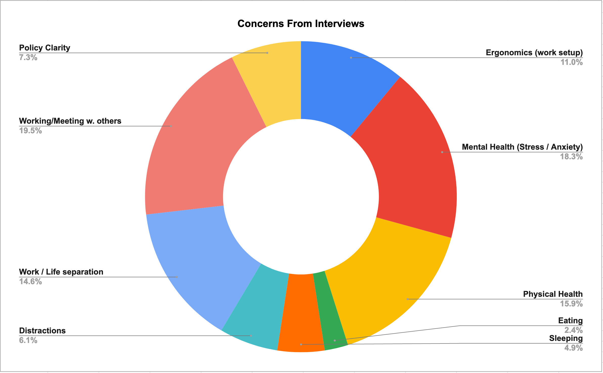

# Remote Wellness Resources for SCS Ph.D. Students
#### From the SCS Ph.D. Dean's Advisory Committee

### Part 1: Links, Resources, and Information 

[Return to Campus Information](https://scsdean.cs.cmu.edu/alerts/return-to-campus.html): Check out columns 1, 2, or 4 as per your needs!

1. General Wellness Resources
    - [Comprehensive List of Wellness Resources](https://docs.google.com/presentation/d/1uWS1Evj3NaM6tDc9hJGdRlnY0L8wmCcCfgC2cM8IlSU/edit): Thank you to Angie Lusk for providing such a comprehensive document. 
    - [Wellness Newsletter (sign up)](https://docs.google.com/forms/d/e/1FAIpQLSfIWGsx9CknX_rVkwveMXgUaz-iuso-ELzUfHqnaKfQhdC4Dw/viewform?fbzx=-8819103409924496297#Be%20Well%20Newsletter%20Sign%20Up): A newsletter with current wellness programming and wellness resources
        -  [Recent Issue](wellness/newsletter.pdf) 
    - [GSA Remote Work Resources Guide ](https://drive.google.com/drive/u/1/folders/1FP8CQDvq44GdU29dDSU2ZOLt-8DbtXwO): This folder is quite comprehensive, with guides from setting up your remote workspace to [wellness guides](https://docs.google.com/document/d/1un_QREocDVPwvYazYtcasvYRufnqRbYcUdADDxOR4iM/edit). 
    - [GSA Vaccine Updates from last meeting]("https://docs.google.com/presentation/d/1uWS1Evj3NaM6tDc9hJGdRlnY0L8wmCcCfgC2cM8IlSU/edit")
    - [CaPS Wellness Resources](https://www.cmu.edu/counseling/resources/index.html): Provider search, crisis services
2. Physical Wellness 
    - [CMU GroupX Classes](https://athletics.cmu.edu/fitness/ondemandhome)
    - [CMU Athletics Beginner Workouts](https://athletics.cmu.edu/fitness/files/BeginnersGuide.pdf)
    - [CMU Athletics "No Excuses" Workout](https://athletics.cmu.edu/fitness/files/TheNoExcusesWorkout.pdf)
    - [Fitness Flyer](wellness/athletics.pdf)
    - Other ideas from students:
        - See if your department has a running group (or start one) 
        - There are many group fitness classes that would be fun to do with your cohort
        -Taking hikes 
3. Mental Wellness
    - [Headspace Meditation App](https://www.cmu.edu/wellness/): Instructions on the bottom half of the page. From Angie Lusk, "Headspace has partnered with Dive in Well, a community of wellness advocates focused on a more equitable and accessible wellness industry; they have added new meditation teachers to lead our members in guided practice. Find it under the Headspace features section on the Explore tab of your app." Thank you, Angie!
    - [Weekly Gratitude Practice](https://tockify.com/carnegie.mellon.student.affairs/detail/933/1611081000000?tags=health-%26-wellness): Tuesdays 1:30-2:30 PM. From the organizer, "It is small and intimate and we have a lot of regular faces while also welcoming any new members!  Our practice always starts with a mindful moment and is rooted in savoring the present moment for all that it teaches us."
    - [Winter break drop in group](https://tockify.com/carnegie.mellon.student.affairs/detail/931/1611169200000?tags=health-%26-wellness): Wednesday 2 PM until Jan 27th
    - [CaPS Resources](https://www.cmu.edu/counseling/virtual-offerings/index.html#students)
    - [CaPS Drop in Groups for all Students](https://www.cmu.edu/counseling/services/spring-2021-virtual-drop-in-groups.pdf)
4. Funding and Ergonomics 
    - Information from the Dean's Office: Previously, there was the  SCS Parents fund and the  Tartan Emergency Fund. These funds have now been combined and now CMU administers funds for all students. Each department has a different approach to providing home office equipment and the department business manager and/or department head should be asked. 
5. Social Connection: We are looking for more resources/ideas. Many socialization avenues are currently department sponsored. 
    - [SCS Coffee Chats (Information)](https://scs-phd-deans-committee.github.io/2020-12-17-coffee-chats.html): After filling out a sign up form (about 2 mins),  you can meet up with other SCS Ph.D. students for one-on-one or group meet up sessions for friendships outside work, research topic match, or mentorship. [Sign up here!](https://docs.google.com/forms/d/e/1FAIpQLSeSLPVpTk_PUAJfUoT2fgWg8uaumJN6_A5KAn9uz_eroUOiaw/viewform)
6. Other: 
    - [Power of Rest Series](https://mediaservices.cmu.edu/channel/%22Power+Of+Rest%22+Restorative+Series/195176753)
    - [Transforming Chronic Pain to Reclaim your Life](https://docs.google.com/forms/d/e/1FAIpQLSdtdXgwlD85tLCGOyenJArP1_y5YxmvA_a1IUACNksHNTdGnA/viewform): May 6th and May 13th
    - [Connection to Nature Mindfulness Series](https://docs.google.com/forms/d/e/1FAIpQLSc-v0AJbyZImiS6JN_XhevlntPdtUJmQjMkQ2A1UCpKRpPaLA/viewform):May 13, 20, and June 3, 10 and 17th, 11-11:45 a.m. EST 
    - [Student Affairs Calendar](https://www.cmu.edu/student-affairs/get-involved/calendar.html)

[Wellness Resources from Angie](https://scs-phd-deans-committee.github.io/wellness/well_resource.docx)
<embed src="https://drive.google.com/viewerng/viewer?embedded=true&url=https://scs-phd-deans-committee.github.io/wellness/well_resource.docx" width="500" height="375">

[Fitness Flyer from CMU Recreation](https://scs-phd-deans-committee.github.io/wellness/athletics.pdf)
<embed src="https://drive.google.com/viewerng/viewer?embedded=true&url=https://scs-phd-deans-committee.github.io/wellness/athletics.pdf" width="500" height="375">

[Wellness Newsletter from BeWell@CMU](https://scs-phd-deans-committee.github.io/wellness/newsletter.pdf)
<embed src="https://drive.google.com/viewerng/viewer?embedded=true&url=https://scs-phd-deans-committee.github.io/wellness/newsletter.pdf" width="500" height="375">

[Additional Wellness Tips](https://scs-phd-deans-committee.github.io/wellness/General_Wellness_Tips.docx)
<embed src="https://drive.google.com/viewerng/viewer?embedded=true&url=https://scs-phd-deans-committee.github.io/wellness/General_Wellness_Tips.docx" width="500" height="375">

[CMU Cares Resources](https://scs-phd-deans-committee.github.io/wellness/cmu_cares.pdf)
<embed src="https://drive.google.com/viewerng/viewer?embedded=true&url=https://scs-phd-deans-committee.github.io/wellness/cmu_cares.pdf" width="500" height="375">

### Part 2: Department Information 

We requested the following information from departments and programs: 
* Has your department/program set any form of mentoring or environment across cohorts that would allow this institutional knowledge to be easily requested and shared?
* We would like to ask if your department/program has provided ways to help students with their ergonomics needs
* Has your department/program set any form of support for students in regard to access to supplies we would otherwise have easy access to on campus?
* Will there be any department-sponsored activities going over break ex: board games, talks, lunches?
* Is there anything from the department to encourage physical and mental wellness over the semester break?
* Are there ways the department is working to maintain work-life balance between students and faculty?

The summaries from the responses are summarized in the following: 

| SCS Department (Programs)  | Response Highlights | Contact Points |
| ------------- |:-------------:|-------------|
| CB      | There are some holiday parties, and the department is planning to check in with all students mid-break. Faculty are taking a course in mental health awareness.   | [Ziv Bar-Joseph](mailto:zivbj@andrew.cmu.edu), [Nicole Stenger](mailto:nstenger@andrew.cmu.edu), [Russell Schwartz](mailto:russells@andrew.cmu.edu)|
| CSD      | Students can participate in social activities such virtual board games and CSD tea. The advisor-advisee form has been good for encouraging conversations between students and their advisors, can be used by students to voice any concerns they might have.    | [Venkatesan Guruswami](mailto:venkatg@andrew.cmu.edu), [Deb Cavlovich](mailto:deb@cs.cmu.edu) |
| HCII      | New students were added to a PhD student Slack and d-list at the beginning of the semester, and have kept in touch through regularly scheduled Tea Times and informally (e.g., through email, Slack, or private Zoom meetings). Students work with their advisors, the program coordinators, and/or SCS Facilities to meet their ergonomics needs, and usually work directly with their advisors for getting supplies.   | [Jeffrey Bigham](mailto:jbigham@andrew.cmu.edu), [Queenie Kravitz](mailto:qkravitz@cs.cmu.edu)|
| ISR (SC + SE Programs)  | Students are encouraged to bring up wellness concerns during townhalls and can request office space or small ergonomics accessories. There were also three catered mentoring lunches for senior PhD students to interact with junior students. | [Nicolas Christin](mailto:nicolasc@andrew.cmu.edu), [Connie Herold](mailto:cherold@andrew.cmu.edu), [Christian Kaestner](mailto:ckaestne@andrew.cmu.edu)|
| LTI     | There are socialization opportunities via Gather Town and weekly board games online. | [Robert Frederking](mailto:ref@cs.cmu.edu), [Stacey Young](mailto:staceyy@cs.cmu.edu)|
| MLD      | There is a Ph.D. mentor program for students and the head of the department meets 1-on-1 with each first year student at the end of each semester. There is also a [wellness network](https://www.ml.cmu.edu/wellness-network/) where faculty volunteer to hold office hours for students. | [Tom Mitchell](mailto:mitchell@andrew.cmu.edu), [Sharon Cavlovich](mailto:sharonw@andrew.cmu.edu) |
| RI      | Quite a few avenues for (virtual) socialization including course working hours and Slack and Facebook groups. Department and advisors engaged in conversations with students for issues related to work-life balance. | [Suzanne Lyons Muth](mailto:scrow@andrew.cmu.edu), [David Wettergreen](mailto:dw0s@andrew.cmu.edu)|

More information is found [here](https://docs.google.com/spreadsheets/d/1-3R50OMJwUHpCq1jrGu7B110nnwSwH8AFqJVYSukvCM/edit?usp=sharing) (only available to those with a CMU email) for highlights from each department.

### Part 3: Interviews
We conducted 28 interviews over 2 months across all departments in SCS of about 15 minutes each. 

| SCS Department  | Students who responded to interview |
| ------------- |:-------------:|
| CB      | 5     |
| CSD      | 4     |
| HCII      | 3     |
| ISR (SC+SE)      | 4     |
| LTI     | 4     |
| MLD      | 3     |
| RI      | 5     |

Some of the most important topics that came up frequently in our interviews were:

* Working/Meeting with others  (advisors, colleagues, labmates)
* Mental Health (Stress / Anxiety)
* Physical Health (exercising, sitting for long periods of time)
* Work / Life separation

Last updated on: April 27th, 2021

Committee Members: Jessica Colnago, Pratik Fegade, Ananya Joshi, Jay Patrikar, Samantha Reig

Please contact scs.phd.committee@gmail.com or aajoshi@andrew.cmu.edu if you have any additions, comments, corrections, or concerns.

